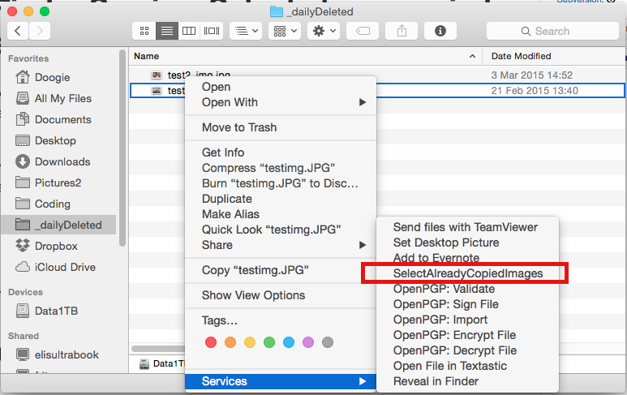

# Mac Finder Service: Select alreay copied images

This is a Service for the Mac Finder. It selects all files (eg. JPG images) in a finder window that already exist under a certain directory. The selected files can then be moved or deleted with Mac Finder.

I use this to list all videos and images from an SD card that I already sorted into my local picutes2 folderstructure before. The Service shows me all picture files that already exist on my local disk.

## Install

Copy the Service folder to `~/Library/Services/` under your home folder on your Mac. Configure the path to your local picture folder in the Automator Workflow.

## Usage

 - Open Mac Finder
 - Navigate to a folder that contains your images (eg. the SD card)
 - Right click -> Services -> SelectAlreadyCopied Images
 - All images that already exist locally will be selected.
 - Now you may for example delete these images from the SD card.

## Licence & Author

This software is public domain. 
Author: www.doogie.de

## How I did this

Finder Services can easily be created with [Automator](http://www.automator.us) under OS X. I used a Perl script for finding the already exiting files, because perl hashes are quite fast. You can open the workflow in Automator and extend it as you like. Happy coding!